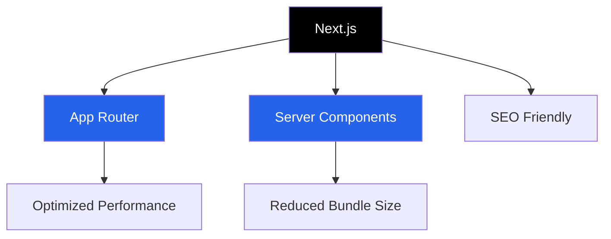

Here's a modern, visually appealing README.md for your GitHub portfolio:

```markdown
# 🚀 Divyanshu Dugar | Developer Portfolio

[](https://divyanshu-dugar-developer-portfolio.vercel.app/)

## 👋 About Me

I'm **Divyanshu Dugar** - a passionate full-stack developer and data enthusiast currently pursuing Computer Programming at Seneca Polytechnic. By day, I build digital solutions; by night, I share self-growth insights through my initiative **[1% Wiser](https://divyanshu-dugar-developer-portfolio.vercel.app/my-books)**.

```typescript
const myStack = {
  code: ["JavaScript", "Python", "Java", "C++"],
  frameworks: ["Next.js", "React", "Node.js", "Express"],
  databases: ["MongoDB", "PostgreSQL", "Firebase"],
  tools: ["Git", "Docker", "Tableau", "Figma"],
  learning: ["TypeScript", "GraphQL", "AWS"]
};
```

## 🌟 Featured Projects

| Project | Tech Stack | Description | Live Demo |
|---------|------------|-------------|-----------|
| [Portfolio Website](https://divyanshu-dugar-developer-portfolio.vercel.app/) | Next.js, Tailwind CSS, Framer Motion | My personal showcase with projects and book recommendations | [Live](https://divyanshu-dugar-developer-portfolio.vercel.app/) |
| [Seneca Course Planner](https://github.com/divyanshu-dugar/seneca-course-planner) | React, Firebase | Tool for Seneca students to plan their courses | Coming Soon |
| [Data Visualization Dashboard](https://github.com/divyanshu-dugar/data-viz-dashboard) | Python, Tableau | Interactive dashboards for business analytics | Private Repo |

## 📚 1% Wiser Book Club

Here are some of my favorite self-growth books I recommend:

<div align="center">
  
[](https://divyanshu-dugar-developer-portfolio.vercel.app/my-books/atomic-habits)
[](https://divyanshu-dugar-developer-portfolio.vercel.app/my-books/deep-work)
[](https://divyanshu-dugar-developer-portfolio.vercel.app/my-books/mindset)

</div>

[Explore All Recommendations →](https://divyanshu-dugar-developer-portfolio.vercel.app/my-books)

## 🛠️ Technical Highlights



- **Blazing Fast**: 98 Lighthouse Performance Score
- **Responsive**: Flawless on all devices
- **Dark Mode**: Easy on the eyes
- **Animations**: Smooth transitions with Framer Motion

## 🌱 What's Growing?

- [ ] Blog integration with MDX
- [ ] Newsletter subscription
- [ ] Guestbook feature
- [ ] Project case studies

## 📬 Let's Connect

<div align="center">

[](https://linkedin.com/in/divyanshu-dugar)
[](https://github.com/divyanshu-dugar)
[](mailto:ddugar@myseneca.ca)
[](https://divyanshu-dugar-developer-portfolio.vercel.app/)

</div>

## 📜 License

MIT © [Divyanshu Dugar](https://github.com/divyanshu-dugar)

---

<div align="center">
  
✨ **"Compounding is the 8th wonder of the world."** ✨

</div>
```
